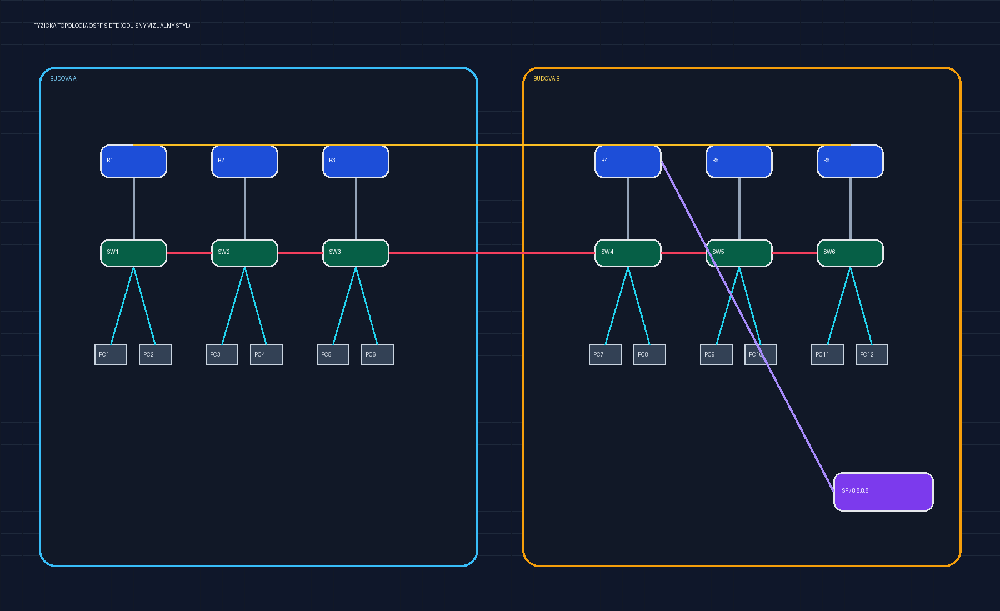
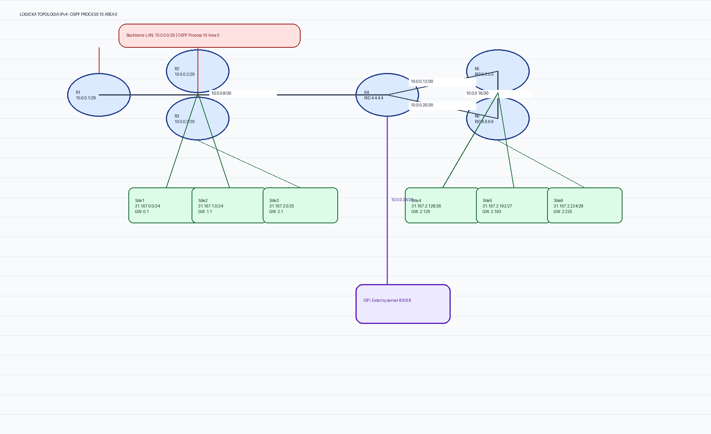

# Dokumentácia návrhu OSPF siete (CCNA)

**Autor:** Daniel Uher  
**OSPF:** proces 10, Area 0  
**IPv4 blok:** 31.167.0.0/16  
**Externý server:** 8.8.8.8

## 1. Úvodný opis

Táto dokumentácia popisuje návrh OSPF siete s backbone doménou v **OSPF procese 10, Area 0**. Backbone časť využíva sieť **10.0.0.0/29** a smerovače medzi lokalitami komunikujú cez **WAN prepojenia /30**. Návrh pokrýva 6 lokalít, 6 routerov (R1–R6), 6 backbone switchov (SW1–SW6) a 12 koncových zariadení (PC1–PC12).

Fyzické rozmiestnenie:
- **Budova A:** R1, R2, R3
- **Budova B:** R4, R5, R6
- **Backbone prepájanie lokalít:** SW1 až SW6
- **Koncové zariadenia:** 12 PC (2 PC na lokalitu)

## 2. Fyzická topológia – tabuľka

| Segment | Umiestnenie | Zariadenia | Popis prepojenia |
|---|---|---|---|
| Budova A | Lokalita A | R1, R2, R3, SW1, SW2, SW3 | R1-R3 sú pripojené do backbone LAN 10.0.0.0/29 cez prepínače |
| Budova B | Lokalita B | R4, R5, R6, SW4, SW5, SW6 | R4-R6 sú prepojené WAN linkami /30 a na ISP vetvu |
| Backbone | Medzibudovový tranzit | SW1-SW6 | Backbone switchová vrstva prepája lokality medzi budovami |
| End Systems | 6 lokalít | PC1-PC12 | Každá lokalita obsahuje 2 koncové zariadenia |

## 3. Logická topológia – tabuľka

| Logický prvok | IPv4 rozsah | Poznámka |
|---|---|---|
| Backbone LAN | 10.0.0.0/29 | Spoločný OSPF segment pre R1, R2, R3 |
| WAN R1-R4 | 10.0.0.8/30 | R1=10.0.0.9, R4=10.0.0.10 |
| WAN R4-R5 | 10.0.0.12/30 | R4=10.0.0.13, R5=10.0.0.14 |
| WAN R5-R6 | 10.0.0.16/30 | R5=10.0.0.17, R6=10.0.0.18 |
| WAN R4-R6 | 10.0.0.20/30 | R4=10.0.0.21, R6=10.0.0.22 |
| WAN R4-ISP | 10.0.0.24/30 | R4=10.0.0.25, upstream smer k 8.8.8.8 |
| Lokálne siete (podľa zadania) | 173.247.x.0/24 | Referenčný vzor v opise logickej topológie |
| Lokálne siete (adresný plán) | 31.167.0.0/24 až 31.167.2.224/28 | Skutočne použité podsiete pre Site1-Site6 |

## 4. Adresný plán IPv4 – tabuľka

| Sieť | Počet hostov | Prefix | Gateway |
|---|---:|---|---|
| Sieť 1 (Site1) | 246 | 31.167.0.0/24 | 31.167.0.1 |
| Sieť 2 (Site2) | 154 | 31.167.1.0/24 | 31.167.1.1 |
| Sieť 3 (Site3) | 73 | 31.167.2.0/25 | 31.167.2.1 |
| Sieť 4 (Site4) | 52 | 31.167.2.128/26 | 31.167.2.129 |
| Sieť 5 (Site5) | 28 | 31.167.2.192/27 | 31.167.2.193 |
| Sieť 6 (Site6) | 12 | 31.167.2.224/28 | 31.167.2.225 |

## 5. Router dokumentácia – tabuľky R1 až R6

### R1

| Rozhranie | IP adresa/maska | Úloha |
|---|---|---|
| Gi0/0 | 10.0.0.1/29 | Backbone |
| Se0/3/0 | 10.0.0.9/30 | WAN link na R4 |

**Router ID:** 1.0.0.0

### R2

| Rozhranie | IP adresa/maska | Úloha |
|---|---|---|
| Fa0/0 | 10.0.0.2/29 | Backbone |
| Fa1/0 | 31.167.0.1/24 | Site1 gateway |
| Fa2/0 | 31.167.1.1/24 | Site2 gateway |

**Router ID:** 31.167.1.1

### R3

| Rozhranie | IP adresa/maska | Úloha |
|---|---|---|
| Fa0/0 | 10.0.0.3/29 | Backbone |
| Fa1/0 | 31.167.2.1/25 | Site3 gateway |

**Router ID:** 31.167.2.1

### R4

| Rozhranie | IP adresa/maska | Úloha |
|---|---|---|
| Se0/3/0 | 10.0.0.10/30 | WAN link na R1 |
| Gi0/0 | 10.0.0.13/30 | WAN link na R5 |
| Gi0/1 | 10.0.0.21/30 | WAN link na R6 |
| Se0/3/1 | 10.0.0.25/30 | WAN link na ISP |

**Router ID:** 4.4.4.4

### R5

| Rozhranie | IP adresa/maska | Úloha |
|---|---|---|
| Fa0/0 | 10.0.0.14/30 | WAN link na R4 |
| Fa1/0 | 10.0.0.17/30 | WAN link na R6 |
| Fa2/0 | 31.167.2.129/26 | Site4 gateway |
| Fa3/0 | 31.167.2.193/27 | Site5 gateway |

**Router ID:** 5.5.5.5

### R6

| Rozhranie | IP adresa/maska | Úloha |
|---|---|---|
| Fa0/0 | 10.0.0.22/30 | WAN link na R4 |
| Fa1/0 | 10.0.0.18/30 | WAN link na R5 |
| Fa2/0 | 31.167.2.225/28 | Site6 gateway |

**Router ID:** 6.6.6.6

## 6. Switch dokumentácia – krátky opis

Prepínače **SW1-SW6** tvoria prenosovú fyzickú vrstvu backbone prepájania medzi lokalitami. V návrhu zabezpečujú L2 konektivitu medzi smerovačmi a koncovými zariadeniami podľa lokality; smerovanie medzi podsieťami realizujú výhradne routery cez OSPF proces 10 v Area 0.

## 7. End-System dokumentácia – tabuľka PC1 až PC12

| PC | Lokalita/Sieť | IPv4 adresa | Maska | Predvolená brána |
|---|---|---|---|---|
| PC1 | Site1 | 31.167.0.10 | /24 | 31.167.0.1 |
| PC2 | Site1 | 31.167.0.11 | /24 | 31.167.0.1 |
| PC3 | Site2 | 31.167.1.10 | /24 | 31.167.1.1 |
| PC4 | Site2 | 31.167.1.11 | /24 | 31.167.1.1 |
| PC5 | Site3 | 31.167.2.10 | /25 | 31.167.2.1 |
| PC6 | Site3 | 31.167.2.11 | /25 | 31.167.2.1 |
| PC7 | Site4 | 31.167.2.130 | /26 | 31.167.2.129 |
| PC8 | Site4 | 31.167.2.131 | /26 | 31.167.2.129 |
| PC9 | Site5 | 31.167.2.194 | /27 | 31.167.2.193 |
| PC10 | Site5 | 31.167.2.195 | /27 | 31.167.2.193 |
| PC11 | Site6 | 31.167.2.226 | /28 | 31.167.2.225 |
| PC12 | Site6 | 31.167.2.227 | /28 | 31.167.2.225 |

## 8. OSPF a smerovanie – popis

Všetky routery R1-R6 sú súčasťou **OSPF procesu 10** v **Area 0**. Backbone doména zahŕňa segment 10.0.0.0/29 a WAN spojenia /30 medzi R1, R4, R5, R6. Routery inzerujú lokálne siete 31.167.x.x podľa prideleného adresného plánu. Router ID sú pevne nastavené:

- R1 = 1.0.0.0
- R2 = 31.167.1.1
- R3 = 31.167.2.1
- R4 = 4.4.4.4
- R5 = 5.5.5.5
- R6 = 6.6.6.6

R4 zabezpečuje výstup smerom na externý server **8.8.8.8** cez WAN vetvu (10.0.0.25/30). Vnútri OSPF domény sa trasy distribuujú dynamicky medzi všetkými lokalitami v jednej backbone oblasti.
